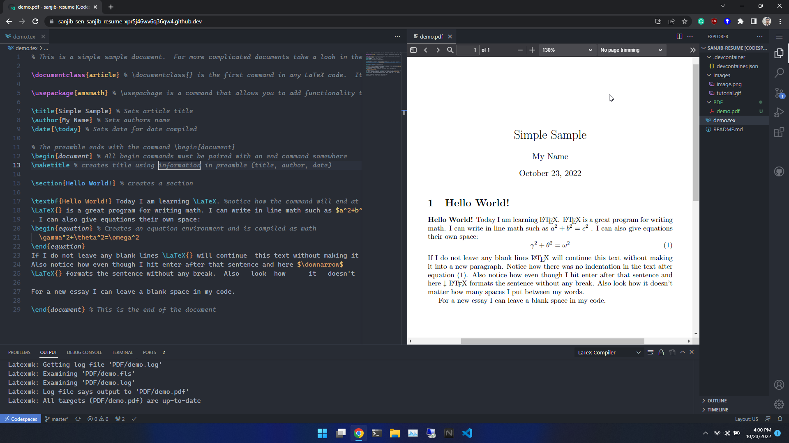
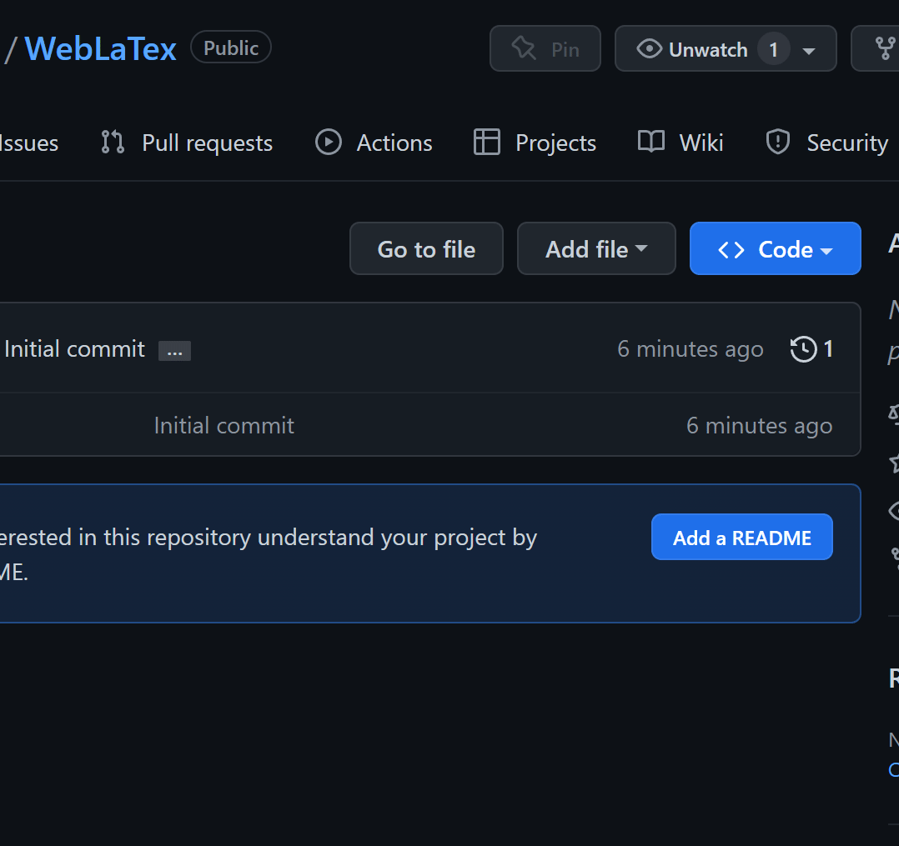
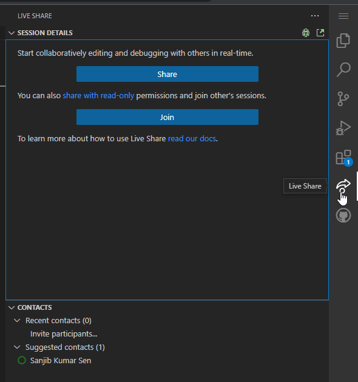

# The WebLatex


> A complete alternative for Overleaf with VSCode + Web + Git Integration + Live Collaboration Support

- [The WebLatex](#the-weblatex)
  - [Screenshot](#screenshot)
  - [Where PDF?](#where-pdf)
  - [Installation Instructions](#installation-instructions)
  - [Editor Instructions](#editor-instructions)
  - [To use with LuaLatex or any other Tex program](#to-use-with-lualatex-or-any-other-tex-program)
  - [Live Collaboration](#live-collaboration)
  - [What's Next](#whats-next)
  - [Contact](#contact)

## Screenshot



## Where PDF?

Generated PDFs will be saved to **`/PDF`** directory

## Installation Instructions

1. Login or Sign Up to [GitHub](https://github.com/login)
2. Fork this repository or just click [Here](https://github.com/sanjib-sen/weblatex/fork)
3. Give it a name and select **Create Fork**
4. Select **<> Code** > **CodeSpaces** > **Create Codespace on Main**
    
5. It will start installing. **You Have to wait for 2 mins in the first time**. After that it will take 2/3 seconds to open up

## Editor Instructions

1. Pressing `Ctrl+S` will save the document and generate PDF in the **PDF** folder
2. To check the generated PDF click on the PDF file. However **It will take 20/30 seconds to open the preview for the first time. So, do not panic**. After that, it will generate and preview the pdf instantly.
3. Your code will be automatically saved and the PDF will generate automatically each time you edit something
4. You can see all the error logs in the **Terminal > Output > Latex Compiler** as well as in the Latex Workshop sidebar
5. If it shows **Error showing PDF** or in case of any inconvenience, just reload the browser or press `Ctrl+R`
6. **Just use it as you use Visual Studio Code**
7. Do not delete the `devcontainer.json` file.

## To use with LuaLatex or any other Tex program

Add this line to your main .tex file

```tex
%!TEX program = <tex_program>
```

For example, to use **`LuaLatex`**:

```tex
%!TEX program = lualatex
```

## Live Collaboration

Just Click on the **Live Share** Sidebar button and you are good to go
  


## What's Next

1. Will optimize the backend to decrease installation time and PDF showing time for the first time
2. Documentation
3. Release: Export PDF as a release version
4. You tell me

## Contact

1. Send an email to `sksenonline@gmail.com`
2. [Facebook](https://www.facebook.com/sanjib.kumarsen.963/), [LinkedIn](https://www.linkedin.com/in/sanjibsen/)
